<h2 align="center">Hi, i am Ali</h2>
<h3 align="center">i basically try to build useful things</h3>
<h4 align="center">Computer Science Student</h4>

**Here are a few things I've built that might be useful:**

- 🔭 **[Curious Tube](https://chromewebstore.google.com/detail/curioustube/ijmemoebckcpddgmlanbljlpjmjfgjpl)** — **Watch what you're curious about, not the algorithm's dictate.**

